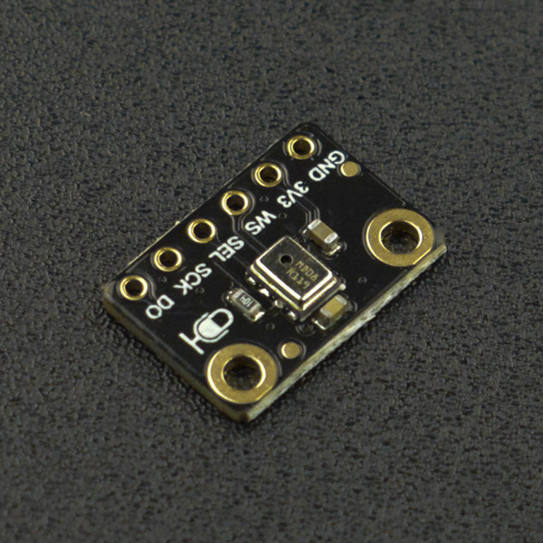

# DFrobot_MSM261
- [中文版](README_CN.md)

This is a microphone library that integrates functionalities for retrieving raw microphone data, storing microphone data on an SD card, and transmitting microphone data via Bluetooth.




## Product Link (https://www.dfrobot.com)

    SKU：SEN0526

## Table of Contents

* [Summary](#summary)
* [Installation](#installation)
* [Methods](#methods)
* [Compatibility](#compatibility)
* [History](#history)
* [Credits](#credits)

## Summary

* Running the example allows real-time retrieval of microphone data.
* Running the example enables microphone data transmission via Bluetooth.
* Running the example can store audio data on an SD card.

## Installation

To use this library, download the library file first, paste it into the \Arduino\libraries directory, then open the examples folder and run the demo in the folder.

## Methods DFrobot_Microphone

```C++
  /**
     * @fn begin
     * @brief Initialize the device
     * @param baudRate Communication rate
     * @param bit Data bit width
     * @return Initialization status
     */
    uint8_t begin(uint16_t baudRate,uint8_t bit);

    /**
     * @fn read
     * @brief Obtain data returned by the microphone
     * @param buffer Buffer to store the acquired data
     * @param len    Length of the data to acquire
     * @return Length of the acquired data
     */
    uint32_t read(char* buffer,size_t len);

    /**
     * @fn createWavHeader
     * @brief Construct the header for a WAVE file
     * @param header The WAVE file header to construct
     * @param totalDataLen Length of the data to write
     * @param longSampleRate Sampling rate
     * @param channels Number of channels
     * @param byteRate Byte rate, calculated as: sampling rate × number of channels × data bit width ÷ 8
     * @param blockAlign Block alignment, calculated as: number of channels × data bit width ÷ 8
     * @return None
     */
    void createWavHeader(byte* header, int totalDataLen, int longSampleRate, uint8_t channels, int byteRate, uint8_t blockAlign);
```
## Methods DFRobot_BluetoothA2DPSource
```C++
  /**
   * @fn begin
   * @brief Initializes Bluetooth and A2DP
   * @param name Name of the Bluetooth slave device to connect to
   * @param callback Callback function for A2DP data transmission
   * @param volume Volume level, range 0~100
   * @return Returns whether the initialization was successful
   * @retval true Initialization successful
   * @retval false Initialization failed
   */
  bool begin(const char* name, esp_a2d_source_data_cb_t callback,uint8_t volume);

```

## Compatibility
MCU                | Work Well    | Work Wrong   | Untested    | Remarks
------------------ | :----------: | :----------: | :---------: | :----:
FireBeetle-ESP32   |      √       |              |             |


## History

- 2022/03/03 - Version 1.0.0 released.

## Credits

Written by TangJie(jie.tang@dfrobot.com), 2022. (Welcome to our [website](https://www.dfrobot.com/))


